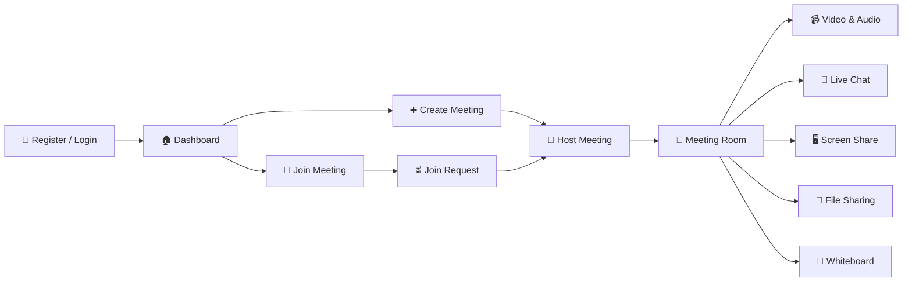

# ⚡ Real-Time Communication App

<div align="center">

### 🎥 Connect. Communicate. Collaborate.

**A full-stack real-time communication platform for seamless video meetings, instant messaging & collaborative work.**

<br/>

[🚀 Live Demo](https://real-time-communication-app-eight.vercel.app) •
[💻 GitHub](https://github.com/tannu01-dev/Real-Time-Communication-App)

<br/><br/>


</div>

---

## 🌟 What is this?

**Real-Time Communication App** is a modern video conferencing and collaboration platform designed to make online communication simple, interactive, and productive.

Users can create secure meeting rooms, invite participants, communicate through **real-time video/audio**, share their screens, exchange files, chat instantly, and collaborate on a shared whiteboard.

> 💡 Think of it as a lightweight combination of **Google Meet + real-time collaboration tools**, built from scratch.

---

## ✨ Features at a Glance

| Feature                   | Description                              |
| ------------------------- | ---------------------------------------- |
| 🎥 **Video Calling**      | Real-time multi-user video communication |
| 🎙️ **Audio Calling**     | Toggle microphone during meetings        |
| 🖥️ **Screen Sharing**    | Share your screen with participants      |
| 💬 **Live Chat**          | Instant real-time messaging              |
| 📁 **File Sharing**       | Share files inside meetings              |
| 🎨 **Whiteboard**         | Collaborative drawing & brainstorming    |
| 👑 **Host Controls**      | Admit, deny & manage participants        |
| 🔐 **Authentication**     | JWT-based secure authentication          |
| 🔗 **Meeting Rooms**      | Unique meeting IDs for every meeting     |
| 👥 **Multi-User Support** | Multiple participants in one meeting     |
| ⚡ **Real-Time Events**    | Powered by Socket.IO                     |

---

# 🎬 Application Flow



---

# 🧠 How Real-Time Communication Works

The application combines **WebRTC + Socket.IO** to provide real-time communication.

```text
              ┌─────────────────┐
              │   React Client  │
              └────────┬────────┘
                       │
              ┌────────▼────────┐
              │    Socket.IO    │
              │ Signaling/Event │
              │    Handling     │
              └────────┬────────┘
                       │
                WebRTC Signaling
                       │
          ┌────────────┴────────────┐
          │                         │
   ┌──────▼──────┐          ┌──────▼──────┐
   │ Participant │◄────────►│ Participant │
   │     A       │  WebRTC  │     B       │
   └─────────────┘          └─────────────┘
```

### 🔌 Socket.IO handles

* Meeting rooms
* Join requests
* Participant events
* Chat messages
* File-sharing events
* Meeting status

### 🎥 WebRTC handles

* Camera streams
* Microphone streams
* Peer-to-peer video
* Peer-to-peer audio
* Screen sharing

---

# 🛡️ Authentication & Meeting Security

```text
Register
   ↓
Login
   ↓
JWT Token
   ↓
Protected Routes
   ↓
Create / Join Meeting
   ↓
Host Authorization
```

### Host controls

The meeting creator automatically becomes the **Host**.

The host can:

```text
👤 User wants to join
        ↓
   Join Request
        ↓
 ┌──────┴──────┐
 ↓             ↓
✅ Admit     ❌ Deny
 ↓             ↓
Meeting       Exit
```

---

# 🛠️ Tech Stack

### 🎨 Frontend

```text
React.js
React Router
Axios
Socket.IO Client
WebRTC
CSS
```

### ⚙️ Backend

```text
Node.js
Express.js
Socket.IO
JWT
Multer
```

### 🗄️ Database

```text
MongoDB
Mongoose
```

### ☁️ Deployment

```text
Frontend → Vercel
Backend  → Render
Database → MongoDB Atlas
```

---

# 📁 Project Structure

```text
Real-Time-Communication-App/
│
├── 📂 backend/
│   ├── 📂 config/
│   ├── 📂 controllers/
│   ├── 📂 middleware/
│   ├── 📂 models/
│   ├── 📂 routes/
│   ├── 📂 uploads/
│   ├── server.js
│   └── package.json
│
├── 📂 frontend/
│   ├── 📂 src/
│   │   ├── 📂 components/
│   │   │   └── Whiteboard.jsx
│   │   │
│   │   ├── 📂 pages/
│   │   │   ├── Login.jsx
│   │   │   ├── Register.jsx
│   │   │   ├── Home.jsx
│   │   │   └── MeetingRoom.jsx
│   │   │
│   │   ├── 📂 services/
│   │   │   ├── api.js
│   │   │   └── socket.js
│   │   │
│   │   └── 📂 styles/
│   │
│   ├── App.jsx
│   ├── main.jsx
│   └── package.json
│
└── README.md
```

---

# 🚀 Run Locally

### 1️⃣ Clone

```bash
git clone https://github.com/tannu01-dev/Real-Time-Communication-App.git

cd Real-Time-Communication-App
```

### 2️⃣ Backend

```bash
cd backend
npm install
```

Create `.env`:

```env
PORT=5000
MONGO_URI=your_mongodb_uri
JWT_SECRET=your_jwt_secret
CLIENT_URL=http://localhost:5173
```

Run:

```bash
npm run dev
```

### 3️⃣ Frontend

Open another terminal:

```bash
cd frontend
npm install
npm run dev
```

---

# 🌐 Live Application

### 🚀 Frontend

[ 🔗Try this application](https://real-time-communication-app-eight.vercel.app)

### ⚙️ Backend

[View Backend](https://real-time-communication-app-ipnm.onrender.com)

> ⚠️ The backend is hosted on Render and may take a few seconds to wake up after inactivity.

---


# 🔥 Why I Built This

This project was built to gain practical experience with:

* Real-time application architecture
* WebRTC peer-to-peer communication
* Socket.IO event-driven systems
* Authentication & authorization
* REST APIs
* MongoDB data modeling
* File uploads
* Collaborative interfaces
* Full-stack deployment

---

# 🚧 Future Improvements

The platform can be extended with:

* 📹 Meeting recording
* 📅 Meeting scheduling
* 🔔 Notifications
* 📝 Meeting notes
* ☁️ Cloud file storage
* 🎨 Advanced whiteboard tools
* 📱 Mobile-first UI
* 🔊 Advanced audio controls
* 👥 Participant management
* 🔒 Enhanced end-to-end encryption

---

# 💻 Developer

<div align="center">

## 👩‍💻 Tannu Pal

**B.Tech CSE | Full-Stack Developer | AI/ML Enthusiast**

<br/>

[GitHub](https://github.com/tannu01-dev)

  •  

[LinkedIn](https://www.linkedin.com/in/tannu-pal-79a08b339)

</div>

---

<div align="center">

### ⭐ If you like this project, give it a star!

**Built with ❤️ using React, Node.js, MongoDB, Socket.IO & WebRTC**

</div>
